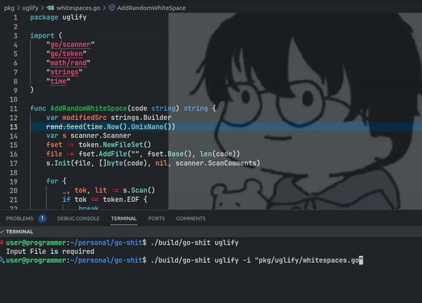

# go-shit

A CLI tool to make your code looks ugly. This is the exact opposite of code prettifiers like Prettier, aiming to make your code look as unorganized and chaotic as possible.



## Installation

1. Clone the repo:
```bash
git clone git@github.com:benodiwal/go-shit.git
```

2. Navigate to directory
```bash
cd go-shit
```

3. Build the application 
```bash
make build
```

4. Run the application
```bash
./build/go-shit [options]
```

## Usage :

```bash
go-shit [options]
```

where [options]:
```bash
1. help
2. version
3. uglify
```

- How to uglify a file:
```bash
go-shit uglify -i <FILE_PATH>
```

## LICENSE
This project is licensed under the MIT License. See the [LICENSE](LICENSE) file for details.
